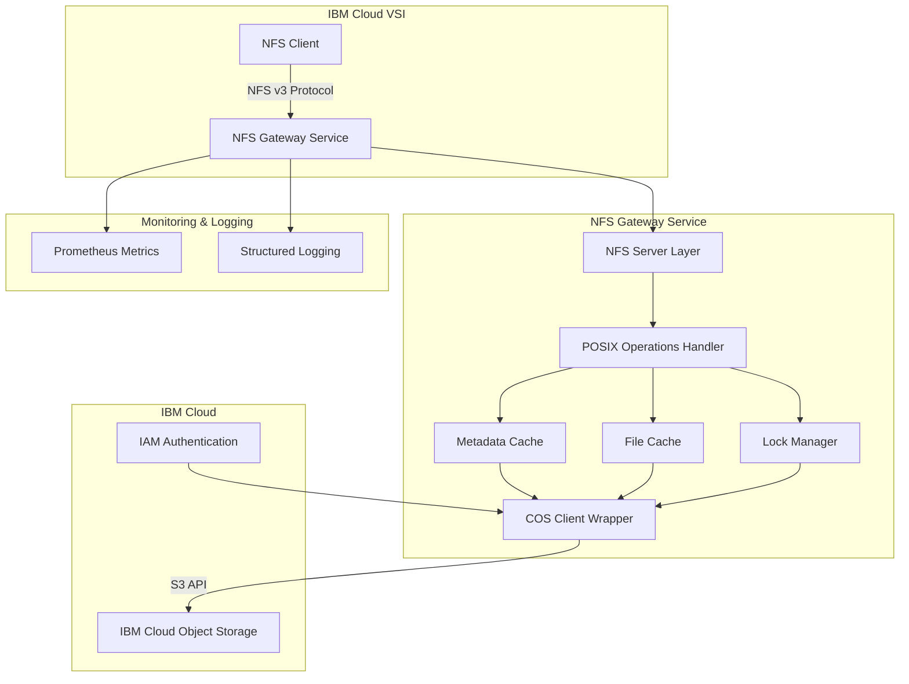

# IBM Cloud COS NFS Gateway - Architecture Design

## Overview

This project implements an NFS gateway service that exposes IBM Cloud Object Storage (COS) as a POSIX-compliant filesystem, similar to AWS S3 Files. The gateway enables IBM Cloud Virtual Server Instances (VSIs) to mount COS buckets as network filesystems.

## System Architecture



## Core Components

### 1. NFS Server Layer
- **Purpose**: Implements NFSv3 protocol server
- **Technology**: Go NFS library (go-nfs or willscott/go-nfs)
- **Responsibilities**:
  - Handle NFS protocol requests
  - Manage NFS sessions and connections
  - Translate NFS operations to internal API calls

### 2. POSIX Operations Handler
- **Purpose**: Maps POSIX filesystem operations to COS operations
- **Key Operations**:
  - `READ`: Fetch object from COS
  - `WRITE`: Upload object to COS
  - `READDIR`: List bucket prefix
  - `LOOKUP`: Check object existence
  - `GETATTR`: Retrieve object metadata
  - `SETATTR`: Update object metadata
  - `CREATE`: Create new object
  - `REMOVE`: Delete object
  - `RENAME`: Copy and delete object
  - `MKDIR`: Create prefix marker
  - `RMDIR`: Remove prefix marker

### 3. Metadata Cache
- **Purpose**: Cache object metadata to reduce COS API calls
- **Implementation**: In-memory LRU cache with TTL
- **Cached Data**:
  - File attributes (size, timestamps, permissions)
  - Directory listings
  - Object existence checks
- **Configuration**:
  - Configurable cache size
  - Configurable TTL (default: 60 seconds)
  - Cache invalidation on write operations

### 4. Enterprise Staging Layer (File Cache)
- **Purpose**: Abstract file streaming via Native caching limits!
- **Deep Dive**: Refer to [docs/STAGING_ARCHITECTURE.md](docs/STAGING_ARCHITECTURE.md)
- **Implementation**: Real-time OS limits enforcing Memory-Mapped (`syscall.Mmap`) abstractions alongside Quota bounds.
- **Features**:
  - Configurable `MaxStagingSizeGB` Quota eviction triggers natively checking `syscall.ENOSPC`.
  - Aggressive 80% Idle threshold flushing asynchronous pipelines.
  - Zero-Copy mapped read boundaries bypassing standard OS string duplication natively!

### 5. Lock Manager
- **Purpose**: Implement distributed file locking
- **Implementation**: 
  - Advisory locks using COS object metadata
  - Lock lease mechanism with timeout
  - Deadlock detection and prevention
- **Lock Types**:
  - Shared (read) locks
  - Exclusive (write) locks

### 6. COS Client Wrapper
- **Purpose**: Abstract IBM Cloud COS API interactions
- **Features**:
  - Connection pooling
  - Retry logic with exponential backoff
  - Request rate limiting
  - Multi-part upload support
  - Streaming downloads

## Technical Specifications

### NFS Protocol Support
- **Version**: NFSv3 (RFC 1813)
- **Transport**: TCP
- **Authentication**: AUTH_SYS (Unix authentication)
- **Port**: 2049 (configurable)

### IBM Cloud COS Integration
- **API**: S3-compatible API
- **Authentication**: IBM Cloud IAM API Key or HMAC credentials
- **Endpoints**: Regional endpoints for optimal performance
- **Features Used**:
  - Standard object operations
  - Multipart uploads for large files
  - Object metadata for POSIX attributes
  - Bucket lifecycle policies

### POSIX Compliance

#### Supported Features
- File operations: open, read, write, close, truncate
- Directory operations: mkdir, rmdir, readdir
- Metadata operations: stat, chmod, chown, utimes
- File locking: advisory locks (flock, fcntl)
- Symbolic links: stored as special objects
- Hard links: not supported (COS limitation)

#### Limitations
- No true inode numbers (generated from object keys)
- Limited support for special files (devices, FIFOs)
- Atomic operations limited by COS capabilities
- Rename operations are copy + delete (not atomic)

### Performance Optimizations

#### Caching Strategy
1. **Metadata Caching**
   - Cache directory listings for fast navigation
   - Cache file attributes to reduce HEAD requests
   - Invalidate on write operations

2. **Data Caching**
   - Read-ahead for sequential access patterns
   - Write buffering to batch small writes
   - Chunk-based caching for large files

3. **Connection Pooling**
   - Reuse HTTP connections to COS
   - Configurable pool size per endpoint
   - Connection health checks

#### Concurrency
- Goroutine pool for handling NFS requests
- Parallel uploads for multipart operations
- Concurrent directory listing with pagination

## Deployment Architecture

### Container Configuration
```
┌─────────────────────────────────────┐
│     NFS Gateway Container           │
│                                     │
│  ┌──────────────────────────────┐  │
│  │   NFS Gateway Service        │  │
│  │   - Port 2049 (NFS)          │  │
│  │   - Port 8080 (Metrics)      │  │
│  │   - Port 8081 (Health)       │  │
│  └──────────────────────────────┘  │
│                                     │
│  ┌──────────────────────────────┐  │
│  │   Configuration              │  │
│  │   - /etc/nfs-gateway/        │  │
│  └──────────────────────────────┘  │
│                                     │
│  ┌──────────────────────────────┐  │
│  │   Cache Volume               │  │
│  │   - /var/cache/nfs-gateway/  │  │
│  └──────────────────────────────┘  │
└─────────────────────────────────────┘
```

### Kubernetes Deployment
- **Deployment Type**: StatefulSet (for cache persistence)
- **Replicas**: Configurable (1-N based on load)
- **Service Type**: LoadBalancer or NodePort
- **Persistent Volumes**: For cache storage
- **ConfigMaps**: For configuration
- **Secrets**: For IBM Cloud credentials

### High Availability
- Multiple gateway instances behind load balancer
- Shared cache using Redis (optional)
- Health checks and automatic failover
- Graceful shutdown handling

## Security Considerations

### Authentication & Authorization
1. **IBM Cloud IAM Integration**
   - Service ID with API key
   - Fine-grained access policies
   - Credential rotation support

2. **NFS Authentication**
   - IP-based access control
   - UID/GID mapping
   - Export restrictions

### Data Security
- TLS for COS API communication
- Encryption at rest (COS feature)
- Encryption in transit (NFS over VPN/private network)
- Secure credential storage (Kubernetes secrets)

### Network Security
- Private network deployment recommended
- Security groups and firewall rules
- VPC isolation
- Optional VPN for remote access

## Monitoring & Observability

### Metrics (Prometheus)
- Request rate and latency
- Cache hit/miss ratios
- COS API call statistics
- Error rates by operation type
- Active connections and sessions
- Cache size and eviction rate

### Logging
- Structured JSON logging
- Log levels: DEBUG, INFO, WARN, ERROR
- Request tracing with correlation IDs
- Audit logging for security events

### Health Checks
- Liveness probe: Service running
- Readiness probe: COS connectivity
- Startup probe: Initialization complete

## Configuration Management

### Configuration File Structure
```yaml
server:
  nfs_port: 2049
  metrics_port: 8080
  health_port: 8081
  max_connections: 1000

cos:
  endpoint: s3.us-south.cloud-object-storage.appdomain.cloud
  bucket: my-bucket
  region: us-south
  auth_type: iam  # or hmac
  api_key: ${IBM_CLOUD_API_KEY}
  
cache:
  metadata:
    enabled: true
    size_mb: 256
    ttl_seconds: 60
  data:
    enabled: true
    size_gb: 10
    path: /var/cache/nfs-gateway
    
performance:
  read_ahead_kb: 1024
  write_buffer_kb: 4096
  multipart_threshold_mb: 100
  multipart_chunk_mb: 10
  worker_pool_size: 100

logging:
  level: info
  format: json
  output: stdout
```

### Environment Variables
- `IBM_CLOUD_API_KEY`: IAM API key
- `COS_ENDPOINT`: COS endpoint URL
- `COS_BUCKET`: Target bucket name
- `CACHE_SIZE_GB`: Data cache size
- `LOG_LEVEL`: Logging level

## Implementation Phases

### Phase 1: Foundation (Weeks 1-2)
- Project setup and structure
- IBM Cloud COS client implementation
- Basic NFS server setup
- Configuration management

### Phase 2: Core Functionality (Weeks 3-5)
- POSIX operation mapping
- Read operations
- Write operations
- Directory operations
- Metadata handling

### Phase 3: Performance & Caching (Weeks 6-7)
- Metadata cache implementation
- Data cache implementation
- Read-ahead and write buffering
- Connection pooling

### Phase 4: Advanced Features (Weeks 8-9)
- File locking mechanism
- Concurrent access handling
- Error handling and recovery
- Performance optimization

### Phase 5: Deployment & Operations (Weeks 10-11)
- Docker containerization
- Kubernetes manifests
- Monitoring and logging
- Health checks

### Phase 6: Testing & Documentation (Weeks 12-13)
- Unit tests
- Integration tests
- Performance testing
- Documentation

## Success Criteria

### Functional Requirements
- ✓ Mount IBM Cloud COS bucket as NFS filesystem
- ✓ Support basic file operations (read, write, delete)
- ✓ Support directory operations
- ✓ POSIX-compliant metadata handling
- ✓ Concurrent access support
- ✓ File locking mechanism

### Performance Requirements
- Read throughput: >100 MB/s per client
- Write throughput: >50 MB/s per client
- Metadata operations: <100ms latency (cached)
- Cache hit ratio: >80% for typical workloads
- Support 100+ concurrent clients

### Operational Requirements
- 99.9% uptime SLA
- Automated deployment via Kubernetes
- Comprehensive monitoring and alerting
- Detailed logging and troubleshooting
- Configuration hot-reload support

## Risks & Mitigations

### Technical Risks
1. **COS API Rate Limits**
   - Mitigation: Aggressive caching, request batching
   
2. **Network Latency**
   - Mitigation: Regional endpoints, read-ahead caching
   
3. **Consistency Challenges**
   - Mitigation: Cache invalidation strategy, eventual consistency model

4. **Large File Performance**
   - Mitigation: Multipart uploads, chunk-based caching

### Operational Risks
1. **Cache Invalidation Complexity**
   - Mitigation: Conservative TTLs, manual invalidation API
   
2. **Credential Management**
   - Mitigation: Kubernetes secrets, IAM service IDs
   
3. **Monitoring Blind Spots**
   - Mitigation: Comprehensive metrics, distributed tracing

## Future Enhancements

### Short-term (3-6 months)
- NFSv4 support
- Read-write cache with write-back mode
- Distributed cache using Redis
- Advanced access control (Kerberos)

### Long-term (6-12 months)
- Multi-bucket support
- Cross-region replication awareness
- AI-powered cache optimization
- Integration with IBM Cloud monitoring services
- Support for IBM Cloud Code Engine deployment

## References

### AWS S3 Files
- AWS S3 Files provides managed NFS access to S3 buckets
- Key features: POSIX compliance, file locking, metadata handling
- Performance: Optimized for cloud-native workloads

### IBM Cloud COS
- S3-compatible object storage
- Regional and cross-region buckets
- IAM integration
- High durability and availability

### Related Projects
- s3fs-fuse: FUSE-based S3 filesystem
- goofys: High-performance S3 filesystem in Go
- go-nfs: NFS server implementation in Go
- minio: S3-compatible object storage with gateway mode