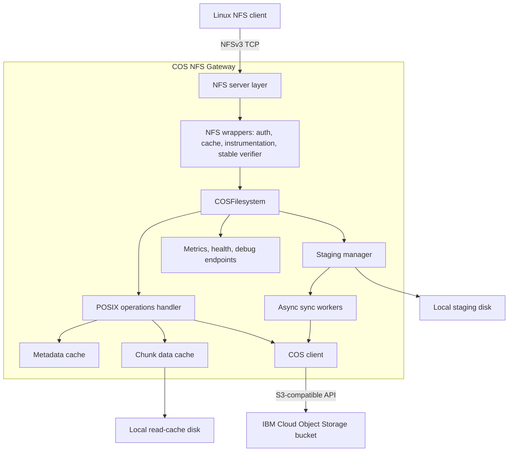
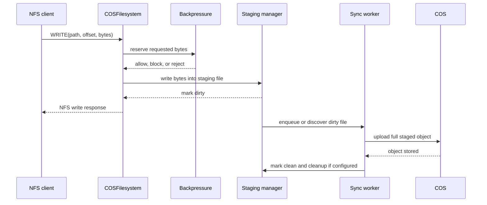

# IBM Cloud COS NFS Gateway Architecture

## Overview

IBM Cloud COS NFS Gateway exposes a single IBM Cloud Object Storage bucket as an
NFSv3 filesystem. Linux clients speak NFS to the gateway; the gateway translates
filesystem operations into COS object operations and uses local disk for staging,
write-back sync, and read caching.

The current architecture is intentionally centered on local correctness:

- Writes are accepted into local staging first.
- Background workers sync dirty staged files to COS asynchronously.
- Read paths prefer dirty/staged data when present, then local cache, then COS.
- Backpressure protects staging capacity before the local filesystem is full.
- Multipart uploads are owned by final sync workers and protected from
  per-object races.
- Crash recovery scans staging metadata and resumes unsynced dirty files.

## High-Level Architecture



## Request Flow

### NFS Layer

The gateway serves NFSv3 over TCP, normally on port `2049`. The NFS stack is
built on a vendored `go-nfs` dependency with local changes needed for gateway
behavior, including filesystem statistics forwarding and deterministic ENOSPC
mapping.

The request path is:

1. NFS client sends an NFSv3 operation.
2. `go-nfs` decodes the request.
3. wrapper handlers apply caching, instrumentation, and stable directory
   verifier behavior.
4. `COSFilesystem` handles filesystem semantics.
5. operations are routed to staging, cache, or COS depending on file state.

### Write Path

Writes use local staging when `staging.enabled` is true.



An accepted write means the gateway accepted data into local staging. It does
not mean the object is already durable in COS. COS durability happens after the
background sync worker uploads the staged file and the object is visible in the
bucket.

Dirty files are tracked by staging metadata. Sync can be triggered by size,
dirty age, close behavior, explicit queueing, or periodic scans depending on
configuration.

### Read Path

Reads follow a consistency-first order:

1. If a file is dirty, syncing, or otherwise has active staged state, read from
   staging.
2. If the requested range exists in the local chunk cache, read from cache.
3. Otherwise fetch from COS using object/range reads.
4. Populate the chunk cache when configured.

Sequential COS reads can use read-ahead and parallel range fetches. Repeated
concurrent fetches for the same range are deduplicated with singleflight to
avoid stampeding COS.

### Directory And Metadata Path

Object keys are translated into filesystem paths. Directory listings are
constructed from COS prefix listings plus local staged state. Metadata cache
entries store file attributes and directory listings with TTL-based expiration.

Write, remove, rename, and metadata-changing operations invalidate relevant
cache entries so clients do not keep reading stale metadata through the gateway.

## Core Components

### `cmd/nfs-gateway`

The executable loads configuration, initializes logging, COS, caches, staging,
sync workers, health endpoints, metrics, debug endpoints, and the NFS server.

Configuration can be provided by YAML and overridden with environment variables
using the `NFS_GATEWAY_` prefix.

### `internal/nfs`

This package adapts NFS requests to the internal filesystem implementation.

Responsibilities include:

- NFS server startup.
- NFS operation handling through `COSFilesystem`.
- stable verifier handling for directory pagination.
- instrumentation wrappers.
- filesystem statistics forwarding so clients can see staging-aware capacity.
- dirty-file read routing through staged state.

### `internal/posix`

This package implements object-backed POSIX-style operations:

- `Stat`, `Read`, `Write`, `Delete`, `Mkdir`, `Rmdir`, `Rename`, and `SetAttr`.
- COS object key/path translation.
- metadata encoding and decoding.
- range and whole-object reads.
- chunk-cache and metadata-cache integration.
- singleflight deduplication for concurrent COS range fetches.

When staging is enabled, the primary write path is handled by `internal/nfs` and
`internal/staging`; the POSIX handler remains responsible for COS-backed reads,
metadata, legacy paths, and object operations.

### `internal/staging`

The staging subsystem is the center of write-back behavior.

Main responsibilities:

- create and manage one local staging session per logical path.
- write incoming NFS data to local staging files.
- track dirty files and dirty bytes.
- apply high/critical watermark backpressure.
- expose pressure and queue state to metrics/debug endpoints.
- recover dirty files after process restart.
- coordinate cleanup after successful sync.
- protect active readers and active multipart uploads from premature cleanup.

The staging directory must be treated as durable local state until sync has
completed. Losing dirty staging files before upload can lose accepted writes.

### `internal/staging/sync_worker`

Sync workers upload dirty staged files to COS. They process queued and scanned
dirty files, retry transient failures, and record upload timing.

For large files, sync workers use multipart upload. Multipart lifecycle is
managed as one active upload session per object sync attempt:

- create multipart upload.
- upload parts with ordered part numbers.
- track ETags.
- complete exactly once when all parts are uploaded and the staged snapshot is
  still current.
- abort failed or stale attempts when safe.
- restart from a clean multipart upload if COS reports an invalid upload
  session such as `NoSuchUpload`.

Per-object synchronization prevents multiple workers from syncing the same path
at the same time.

### `internal/cache`

The cache subsystem has two layers:

- Metadata cache: in-memory LRU with TTL for attributes and directory entries.
- Data cache: local disk chunk cache for object ranges.

The data cache is optimized for repeated and sequential reads. It is not the
durability mechanism for writes; that role belongs to staging.

### `internal/cos`

The COS client wraps IBM Cloud COS S3-compatible operations:

- object stat/head.
- object get and range get.
- put object.
- delete object.
- list objects by prefix.
- multipart create/upload-part/complete/abort.

Authentication supports IAM API key and HMAC credentials according to
configuration.

### `internal/metrics` And `internal/health`

The gateway exposes optional HTTP endpoints for operations:

- Prometheus metrics on `127.0.0.1:<metrics_port>/metrics`.
- health endpoints on `127.0.0.1:<health_port>/health/*`.
- debug endpoints on `127.0.0.1:<debug_port>/debug/*`.

The debug staging endpoint reports dirty files, sync queue depth, queue bytes,
staging pressure, last sync timing, COS visibility latency, and upload
throughput.

## Staging Backpressure

Backpressure is enforced before staging is full. The gateway computes staging
pressure from configured size limits and current staged bytes.

Pressure levels:

- `normal`: writes are allowed.
- `high`: block mode can wait for sync drain before allowing more writes.
- `critical`: writes are rejected early or fail after the configured wait
  timeout.

Modes:

- `block`: wait for pressure relief until `backpressure_wait_timeout`.
- `fail_fast`: reject immediately at or above the critical watermark.

Backpressure decisions are logged with:

- path.
- requested bytes.
- available bytes.
- pressure level.
- decision: `allow`, `block`, or `reject`.

NFS filesystem statistics are staging-aware, so clients can see reduced
available space before staging is fully exhausted.

## Crash Safety Model

Crash safety is based on preserving local staging state.

Accepted writes remain dirty until sync completes. On restart, the gateway scans
staging metadata and active staging files, rebuilds the dirty index, and resumes
sync. If a crash happens during multipart upload, the gateway does not rely on
the old in-memory upload state; it starts a clean sync attempt from the staged
file.

This model depends on:

- reliable local storage for `staging.root_dir`.
- not deleting staging files manually while they are dirty.
- keeping `clean_after_sync` cleanup limited to files that are already clean and
  no longer needed by active handles.

## Consistency Model

The gateway provides local read-after-write consistency through staging: a
client that writes a file can read the dirty version from the gateway before COS
sync completes.

COS is still an object store, so some filesystem operations are approximations:

- rename is implemented through object operations and is not equivalent to a
  local filesystem atomic rename across every failure mode.
- hard links are not supported as native object-store constructs.
- generated file identity is based on path/object metadata rather than true
  persistent inode allocation from COS.
- multi-gateway active/active writes to the same bucket are not a supported
  consistency model unless external coordination is added.

## Configuration Shape

The main configuration groups are:

```yaml
server:
  nfs_port: 2049
  metrics_enabled: true
  metrics_port: 8080
  health_enabled: true
  health_port: 8081
  debug_enabled: true
  debug_port: 8082

cos:
  endpoint: "s3.us-south.cloud-object-storage.appdomain.cloud"
  bucket: "my-nfs-bucket"
  region: "us-south"
  auth_type: "iam"
  api_key: "..."
  service_id: "..."

cache:
  metadata:
    enabled: true
    size_mb: 256
    ttl_seconds: 60
    max_entries: 10000
  data:
    enabled: true
    size_gb: 10
    path: "/var/cache/nfs-gateway"
    chunk_size_kb: 1024

performance:
  read_ahead_kb: 8192
  multipart_threshold_mb: 100
  multipart_chunk_mb: 10
  max_concurrent_reads: 50
  max_concurrent_writes: 25
  max_full_object_read_mb: 512
  max_buffered_write_mb: 512
  max_directory_entries: 100000

staging:
  enabled: true
  root_dir: "/var/staging/nfs-gateway"
  sync_interval: "30s"
  sync_threshold_mb: 10
  max_dirty_age: "5m"
  max_staging_size_gb: 10
  sync_worker_count: 4
  sync_queue_size: 100
  clean_after_sync: true
  backpressure_enabled: true
  backpressure_mode: "block"
  backpressure_high_watermark_percent: 80
  backpressure_critical_watermark_percent: 95
  backpressure_wait_timeout: "30s"
```

See `configs/config.example.yaml` for the complete current example.

## Observability

Important Prometheus metrics include:

- `staging_used_bytes`
- `staging_available_bytes`
- `staging_pressure_level`
- `writes_blocked_total`
- `writes_rejected_total`
- `backpressure_wait_seconds`
- `sync_queue_bytes`
- `staging_sync_queue_depth`
- `staging_sync_queue_bytes`
- `staging_cos_visibility_latency_seconds`
- `staging_upload_duration_seconds`
- `staging_upload_throughput_mib_per_second`
- `cache_hits_total`
- `cache_misses_total`
- `nfs_requests_total`
- `cos_api_calls_total`

Important debug endpoints include:

- `/debug/staging/sync`: staging, sync queue, pressure, and last upload state.
- `/debug/perf`: aggregate gateway performance counters.
- `/debug/perf/paths`: per-path instrumentation data.

## Deployment Model

The gateway can run directly on a Linux host, in Docker, or in Kubernetes. The
most important deployment requirement is persistent local storage for staging
and adequate local storage for cache.

Recommended production shape:

- one gateway instance owns one mounted export.
- staging path on reliable local or attached disk.
- cache path on local or attached disk sized for the read working set.
- NFS port exposed only to trusted clients.
- COS credentials provided through environment variables, local secret files,
  or Kubernetes secrets.
- metrics, health, and debug endpoints kept on localhost or protected networks.

Container and Kubernetes examples live under `deployments/`, but they are
deployment templates rather than a complete production platform.

## Security Boundaries

The gateway assumes the operator controls the Linux host or network where NFS is
mounted. NFS access is not authenticated by the gateway itself. Access control
must be provided by host firewall rules, VPC security groups, Kubernetes network
policy, private networking, or equivalent infrastructure controls.

COS access is authenticated with the configured IBM Cloud credentials. Those
credentials should be scoped to the target bucket and stored outside source
control.

COS API traffic uses HTTPS through the IBM COS SDK. NFS traffic is plain NFSv3
and should be kept on trusted networks.

## Benchmark Architecture

The formal benchmark suite runs outside the gateway against a mounted export.
It records human-readable summaries, JSON, CSV, baseline files, environment
capture, and monitor samples.

Benchmark categories cover:

- frontend write performance.
- time-to-durable in COS and sync throughput.
- cold and warm reads.
- range, random, and large sequential reads.
- backpressure behavior.
- small-file workloads.
- crash safety.
- mixed dirty-read and concurrent workloads.

See `docs/BENCHMARK_SUITE.md` for benchmark operation details.
